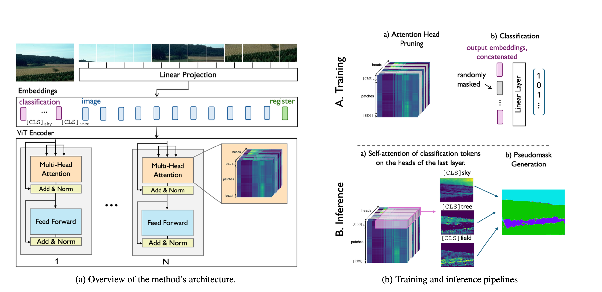

# Know Your Attention Maps: Class-Specific Token Masking for Weakly Supervised Semantic Segmentation

This repository provides the official implementation of our **ICCV 2025** paper: "Know Your Attention Maps: Class-Specific Token Masking for Weakly Supervised Semantic Segmentation". Our approach introduces a simple yet powerful modification of Vision Transformers for **Weakly Supervised Semantic Segmentation (WSSS)**. By assigning one **[CLS] token per class**, enforcing **class-specific masking**, and leveraging **attention-based class activation**, we generate high-resolution **pseudo-masks** directly from transformer attention—without CAMs or post-processing.

The paper can be found here: [ICCV proceedings](https://openaccess.thecvf.com/content/ICCV2025/papers/Hanna_Know_Your_Attention_Maps_Class-specific_Token_Masking_for_Weakly_Supervised_ICCV_2025_paper.pdf) | [arxiv](https://arxiv.org/abs/2507.06848).


<p align="center">
  
</p>

---

# **Summary**

We revisit the role of [CLS] tokens in multi-label classification and show that:

* A transformer with **one [CLS] token per class** can learn structured, interpretable attention.
* Introducing **random token masking** encourages each class token to specialize.
* Class-specific attention maps can be converted into **dense pseudo-masks**, suitable for training segmentation models.
* Optional **attention head pruning** (via Hard Concrete gates) further sharpens attention and improves pseudo-mask quality.

The result is a **clean, single-stage WSSS pipeline** that achieves competitive pseudo-mask quality across diverse domains.

---

# **Code Structure**

```
.
├── run.py                        # Main training script (classification + token masking)
├── generate_pseudomasks.py       # Produce pseudo-masks from class tokens + attention
├── model.py                      # ViTWithTokenDropout and supporting modules
├── recorder_tokendropout.py      # Extracts attention maps from ViT layers
├── datasets/
│   ├── dfc.py                    # DFC2020 dataset loader
│   ├── ade.py                    # ADE20K dataset loader
│   └── ...                       # Add your own dataset here
├── checkpoints/                  # Saved checkpoints
├── assets/                      
└── README.md
```

<!-----

# **Installation**

This project was developed with **Python 3.10** and **PyTorch ≥ 2.1**.

```bash
pip install -r requirements.txt
```

If you need CUDA-enabled PyTorch:

```bash
pip install torch torchvision torchaudio --index-url https://download.pytorch.org/whl/cu121
```

----->

# **Training**

Training is performed using the unified script `run.py`.

## **Example Training Command**

A typical configuration for the **DFC2020** dataset:

```bash
python run.py \
    --dataset dfc \
    --train_batch_size 4 \
    --eval_batch_size 4 \
    --learning_rate 0.000001 \
    --patch_size 16 \
    --opt adam \
    --lr_scheduler \
    --imgsize 224 224 \
    --num_channels 13 \
    --num_classes 8 \
    --num_epochs 500 \
    --arch tokendropout \
    --diversify \
    --exp_name dropout_token \
    --dp_rate 0.0
```

This launches training with:

* multi-class token ViT architecture,
* random token masking,
* optional attention-head pruning,
* logging and checkpointing 

---

# **Generating Pseudo-Masks**

Once training is completed, pseudo-masks can be generated with:

```bash
python generate_pseudomasks.py --dataset dfc --checkpoint <path_to_ckpt>
```

This script:

1. Loads the trained ViTWithTokenDropout model
2. Extracts class-specific attention maps
3. Converts attention into dense pseudo-masks
4. Saves:

```
pms_<dataset>.npy    # pseudo-masks
imgs_<dataset>.npy   # raw images
masks_<dataset>.npy  # ground-truth masks (if provided)
```


<!--# **Pre-trained Checkpoints**

We will release trained checkpoints here soon.
Stay tuned.

----->

# **Reference**

If you use this repository in your research, please cite:

```bibtex
@InProceedings{Hanna_2025_ICCV,
    author    = {Hanna, Jo\"elle and Borth, Damian},
    title     = {Know Your Attention Maps: Class-specific Token Masking for Weakly Supervised Semantic Segmentation},
    booktitle = {Proceedings of the IEEE/CVF International Conference on Computer Vision (ICCV)},
    month     = {October},
    year      = {2025},
    pages     = {23763-23772}
}
```


# **Contact**

For questions, issues, or discussions:

**Joëlle Hanna**
University of St. Gallen
[joelle.hanna@unisg.ch](mailto:joelle.hanna@unisg.ch)

# Code
This repository incorporates code from the following sources:
* [Vision transformers](https://github.com/xulianuwa/MCTformer)
* [Attention pruning](https://github.com/lena-voita/the-story-of-heads)
